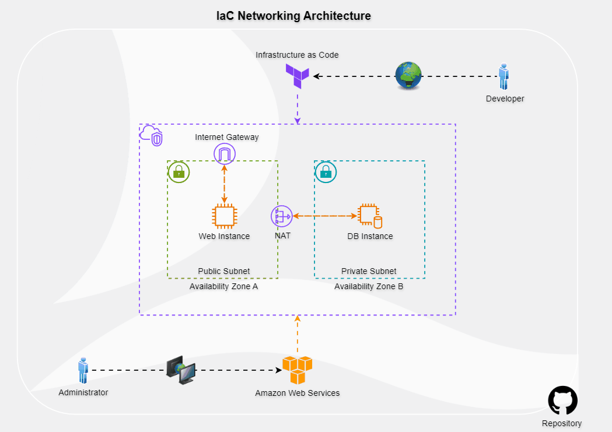
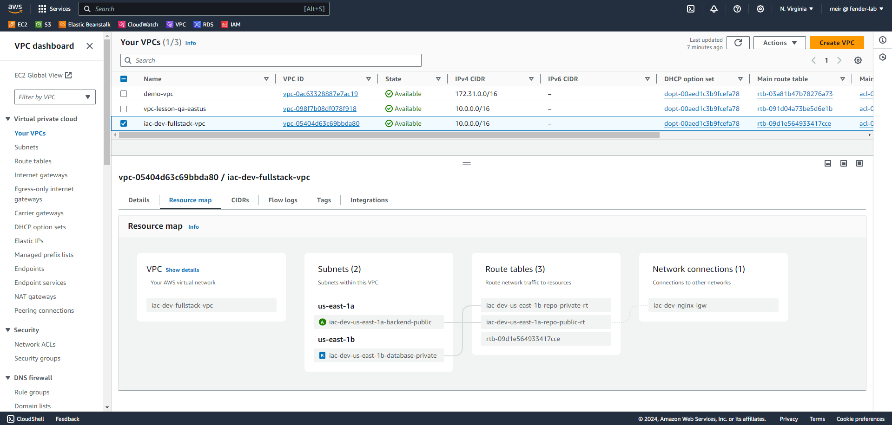

## Overview

This project demonstrates the implementation of Infrastructure as Code (IaC) using **Terraform** to set up a comprehensive networking environment on **AWS**. The setup includes:

- **VPC** (Virtual Private Cloud)
- **Subnets** (Public and Private)
- **Security Groups** (To manage access)
- **Route Tables**
- **NAT Gateway** (For private subnet internet access)
- **Internet Gateway** (For public subnet internet access)

Additionally, **EC2 instances** are deployed in both public and private subnets, with configured security groups to allow communication between them. 

AWS is used for its robust services and free tier availability, making it an ideal choice for managing infrastructure efficiently.

## Features

- **Network Setup**: Creates and configures a VPC with public and private subnets.
- **Security Groups**: Controls inbound and outbound traffic.
- **EC2 Instances**: Deployed in both subnets for testing connectivity.
- **NAT & IGW**: Provides internet access for private and public subnets.
- **Terraform Automation**: Manages the entire infrastructure setup through code.

## Getting Started

### Prerequisites

- AWS Account
- Terraform installed
- AWS Access Key and Secret Key

### 1. Clone the Repository

```bash
git clone https://github.com/YakirBar/IaC-Networking-Project.git
```

### 2. Configure AWS Access Key

1. Open the AWS Sign-In page: [AWS Sign-In](https://eu-north-1.signin.aws.amazon.com).
2. Create an AWS account or sign in.
3. Navigate to **IAM** -> **Users** -> **Security Credentials**.
4. Generate new **Access Keys**.
5. Save your **Access Key** and **Secret Key** for use in the Terraform configuration file (`main.tf`).

### 3. Run Terraform

1. Navigate to the Terraform directory:
   ```bash
   cd /IaC-Networking-Project/terraform
   ```
2. Initialize Terraform:
   ```bash
   terraform init
   ```
3. Generate an execution plan:
   ```bash
   terraform plan
   ```
4. Apply the Terraform configuration:
   ```bash
   terraform apply
   ```
5. Verify resources in the AWS Console:
   - Go to **VPC** -> **Your VPCs**.
   - Check **EC2** -> **Instances**.

6. To clean up resources, run:
   ```bash
   terraform destroy
   ```



## Enjoy!

This setup provides a scalable and secure network infrastructure for your applications. Feel free to explore and modify the configurations to suit your needs!

Contributions and feedback are welcome. Happy coding!